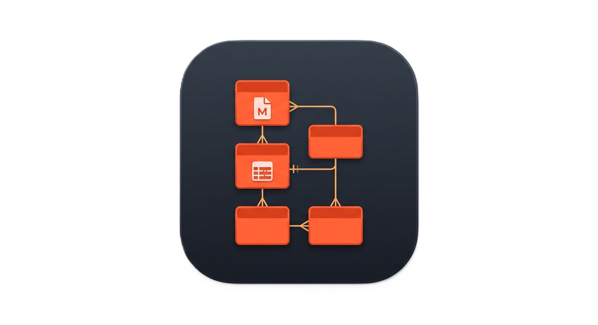
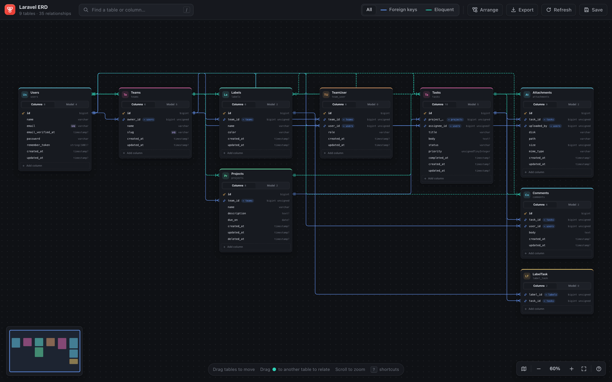
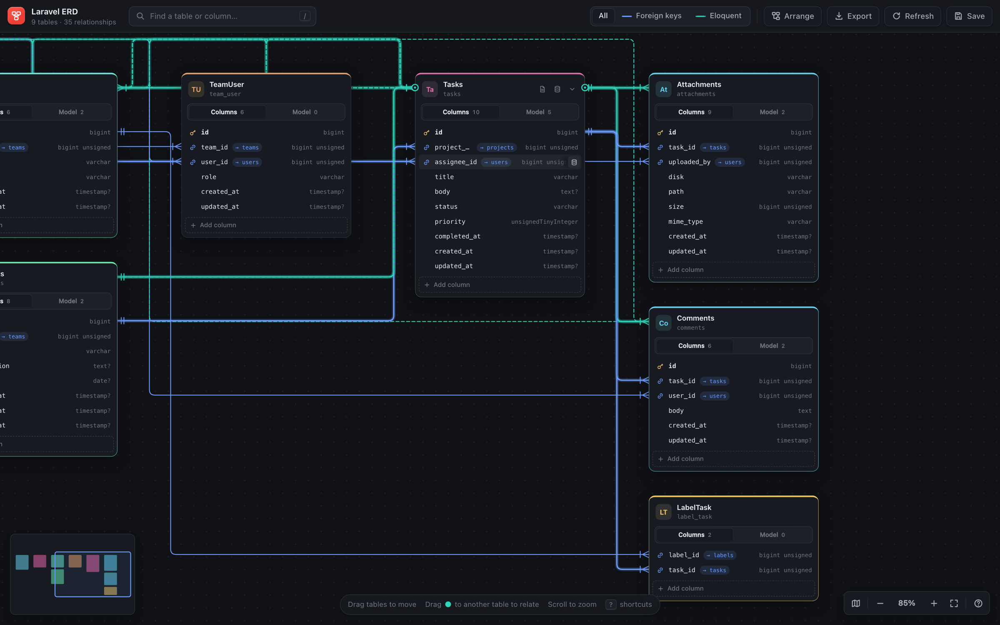
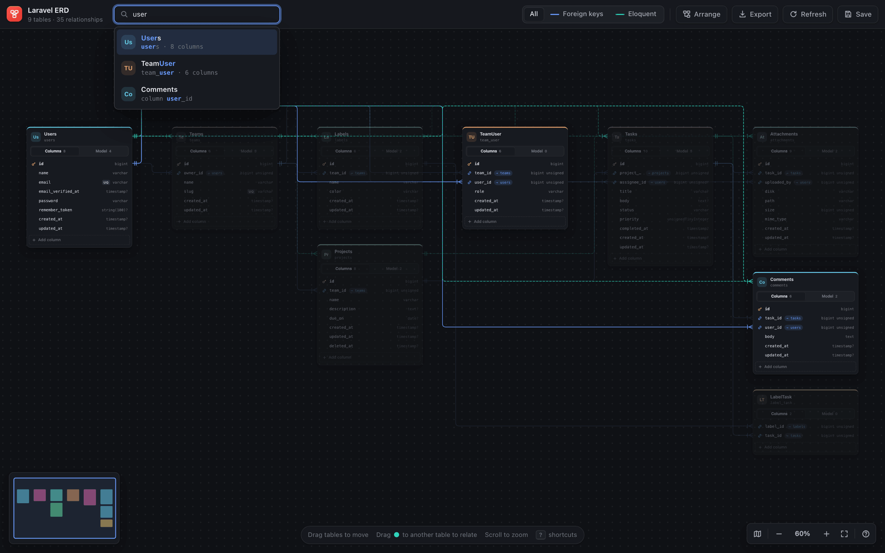
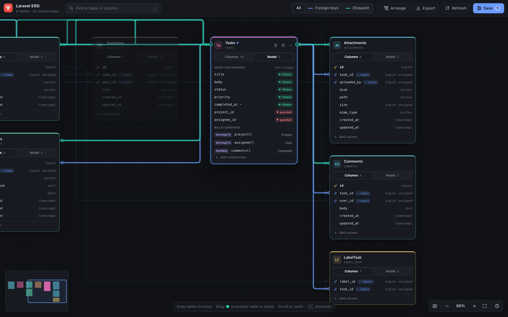
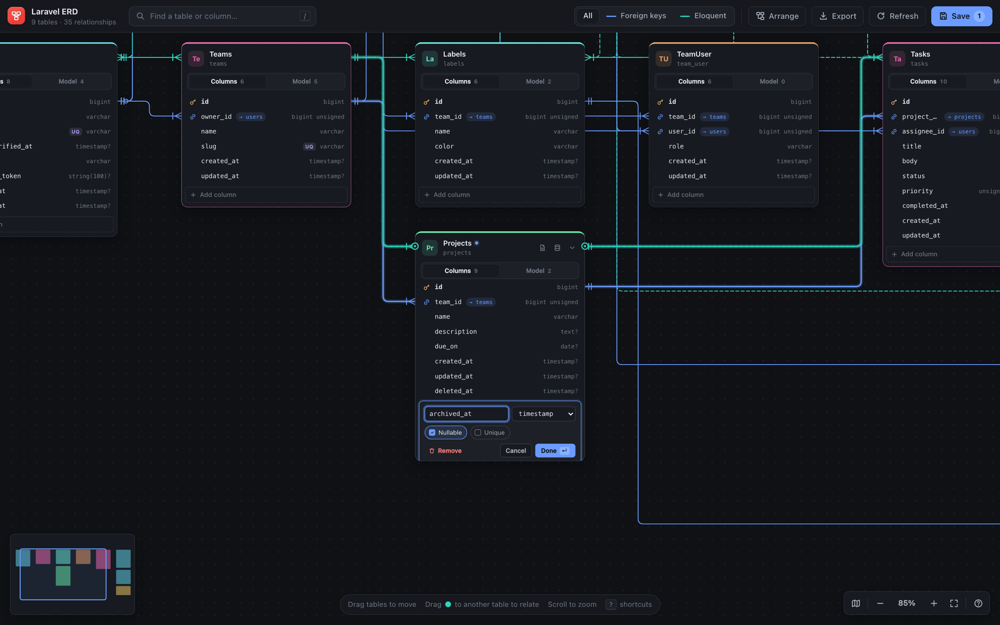
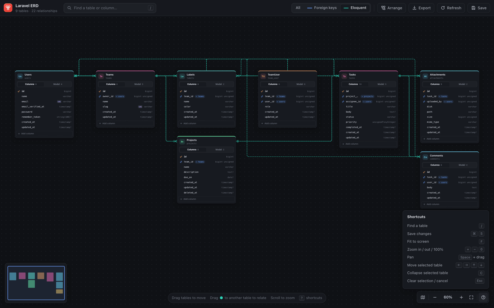
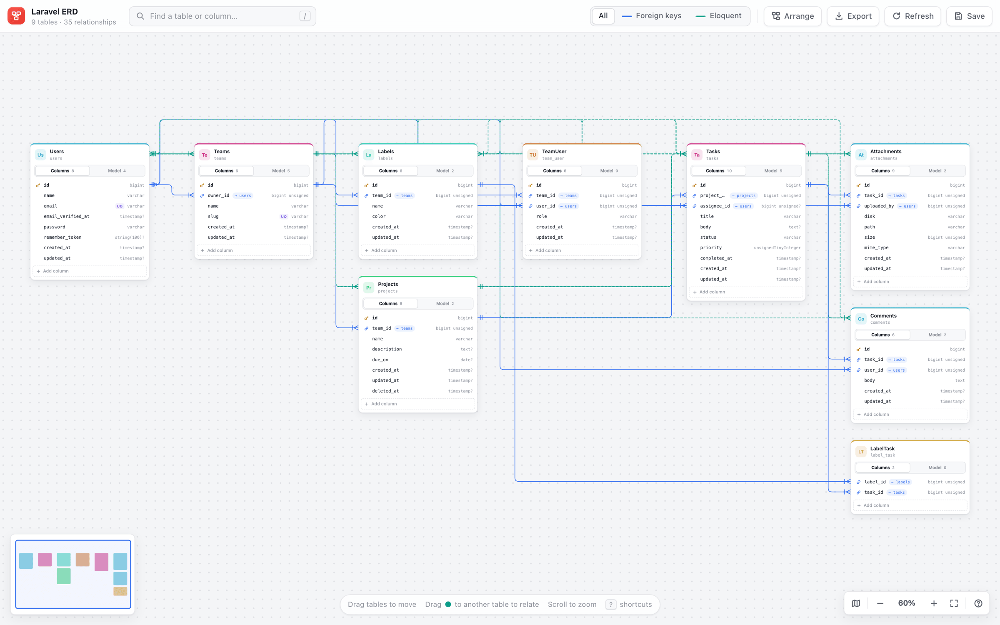

<div align="center">



# Laravel ERD

**See your entire Laravel schema at a glance, right inside VS Code.**

Laravel ERD reads your migrations and Eloquent models and turns them into a live, interactive entity relationship diagram. No database connection, no config, no artisan commands.

[](https://marketplace.visualstudio.com/items?itemName=samueljarai.laravel-erd)
[](https://code.visualstudio.com/)
[](https://laravel.com/)
[](LICENSE)

[Install](#installation) · [Features](#features) · [Usage](#usage) · [How saving works](#how-saving-works) · [FAQ](#faq)

<br>



</div>

---

## Why Laravel ERD

Schemas in Laravel live in two places: migrations describe the tables, and models describe how they relate. Reading both to understand a codebase is slow, and diagrams drawn by hand go stale the day they're made.

Laravel ERD reads both straight from your source files and keeps the diagram in sync as you work:

- **Zero setup.** Open a Laravel project and the extension activates. Nothing to install in your app, and no database to connect.
- **Always current.** It watches `database/migrations` and your models, so the diagram updates when the code changes.
- **Two layers, one picture.** Foreign key constraints from migrations and Eloquent relationships from models are drawn side by side, so you can see when they disagree.
- **Edits that go back to code.** Toggle `$fillable`/`$guarded`, add relationships, and add columns. Saving writes real PHP to your models and creates a new alter migration.

## Features

### Explore



- **Automatic layout.** Tables are arranged in layers, with referenced tables placed left of the tables that point to them. Click **Arrange** to run the layout again at any time.
- **Precise relationship lines.** Lines attach to the actual FK column rows and use crow's foot notation, with a circle marking a nullable foreign key. Hover a line for details, or click it to jump to the other table.
- **Focus mode.** Select or hover a table and its related tables light up while everything else fades back.
- **Clickable FK chips.** Every foreign key shows its target (`→ users`). Click it to fly to that table.
- **Infinite canvas.** Pan, zoom from 15% to 250%, fit to screen, and use a live minimap.
- **Persistent layout.** Card positions, collapsed cards, active tabs, and the viewport are remembered per workspace, even when entities are renamed.

### Search anything



Press <kbd>/</kbd> or <kbd>⌘F</kbd> to search across table names, model names, and columns. Press <kbd>Enter</kbd> to jump to the result, which is centered, selected, and briefly highlighted.

### Inspect and edit models



Each card has two tabs:

| Tab | What you get |
| --- | --- |
| **Columns** | PK and FK icons, column types (`?` marks nullable), `UQ` badges for unique columns, FK targets you can click, and inline editing for new columns |
| **Model** | One-click `$fillable` ↔ `$guarded` toggles and every parsed Eloquent relationship, with an **Add relationship** button |

Changed fields are marked with a dot, and the **Save** button shows how many changes are unsaved.

### Add columns and relationships visually



- **Add a column** with a name, type, nullable, and unique flag directly on the card. When you save, Laravel ERD generates a new alter migration and leaves your existing migrations untouched.
- **Draw a relationship** by dragging the handle on a card's edge onto another card. Pick `hasMany`, `hasOne`, `belongsTo`, or `belongsToMany`, check the generated method preview, and confirm.

### Filter, export, and shortcuts



- **Relationship filter:** show **All**, only **Foreign keys** (solid blue), or only **Eloquent** relationships (dashed teal).
- **Export to SVG:** save a crisp, scalable snapshot for docs, PRs, or onboarding guides.
- **Keyboard first:** every common action has a shortcut. Press <kbd>?</kbd> to see them all.

### Looks at home in any theme



The diagram follows your VS Code color theme and switches between light and dark instantly when you change themes.

## Installation

**From VS Code:** open the Extensions view (<kbd>⇧⌘X</kbd> / <kbd>Ctrl+Shift+X</kbd>), search for **Laravel ERD**, and click **Install**.

**From the command line:**

```bash
code --install-extension samueljarai.laravel-erd
```

**From a `.vsix` file:** run **Extensions: Install from VSIX…** from the command palette.

### Requirements

- VS Code **1.80** or newer
- A Laravel project with migrations in `database/migrations/`
- Eloquent models in `app/Models/` (with `app/` as a fallback)

## Usage

1. Open a Laravel project. The extension activates when it finds an `artisan` file.
2. Click the **Laravel ERD** icon in the activity bar, or run **Laravel ERD: Open ERD** from the command palette (<kbd>⇧⌘P</kbd>).
3. Explore. Drag cards anywhere, double-click a header to collapse it, and use the card header icons to open the migration or model file beside the diagram.
4. Edit, then press <kbd>⌘S</kbd> to write your changes back to disk.

Multi-root workspaces are supported. The diagram opens for the Laravel project that contains the file you're editing, falling back to the first Laravel folder in the workspace.

### Commands

| Command | Description |
| --- | --- |
| `Laravel ERD: Open ERD` | Open (or reveal) the diagram for the current Laravel project |
| `Laravel ERD: Refresh` | Re-parse migrations and models from disk |

### Keyboard shortcuts

| Action | Shortcut |
| --- | --- |
| Find a table or column | <kbd>/</kbd> or <kbd>⌘F</kbd> |
| Save changes | <kbd>⌘S</kbd> / <kbd>Ctrl+S</kbd> |
| Fit to screen | <kbd>F</kbd> |
| Zoom in / out / reset to 100% | <kbd>+</kbd> <kbd>−</kbd> <kbd>0</kbd> |
| Pan | <kbd>Space</kbd> + drag, or drag the background |
| Move the selected table | <kbd>←</kbd> <kbd>→</kbd> <kbd>↑</kbd> <kbd>↓</kbd> |
| Collapse the selected table | <kbd>C</kbd> |
| Clear selection / cancel | <kbd>Esc</kbd> |
| Show all shortcuts | <kbd>?</kbd> |

## How saving works

Saving is deliberately conservative: it only touches what you changed, and never rewrites migrations that have already been written.

| You change… | Laravel ERD writes… |
| --- | --- |
| `$fillable` / `$guarded` | Updates the array in the model, or adds the property if the model doesn't have one |
| A new relationship | Appends a new method to the model class |
| A new column | Creates a timestamped `Schema::table(...)` alter migration with matching `up()` and `down()` methods |

A generated migration looks like this:

```php
return new class extends Migration
{
    public function up(): void
    {
        Schema::table('projects', function (\Illuminate\Database\Schema\Blueprint $table) {
            $table->timestamp('archived_at')->nullable();
        });
    }

    public function down(): void
    {
        Schema::table('projects', function (\Illuminate\Database\Schema\Blueprint $table) {
            $table->dropColumn('archived_at');
        });
    }
};
```

Columns that already exist are read-only in the diagram. Their row action opens the migration that defines them. If files change on disk while you have unsaved edits, Laravel ERD asks whether to keep your edits or reload, so nothing is overwritten silently.

## What gets parsed

<details>
<summary><b>Migrations</b></summary>

- `Schema::create(...)` and `Schema::table(...)`, merged in chronological order
- Common column types: `string`, `text`, `integer`, `bigInteger`, `boolean`, `timestamp`, `json`, `uuid`, `decimal`, `date`, `enum`, and more
- Shorthands: `id()`, `timestamps()`, `softDeletes()`, `rememberToken()`
- Modifier chains, including ones split across lines: `->nullable()`, `->unique()`, `->default(...)`, `->unsigned()`
- `foreignId(...)->constrained()`, with or without an explicit table
- `foreign(...)->references(...)->on(...)`, including when the column is defined in a different migration file

</details>

<details>
<summary><b>Models</b></summary>

- Classes extending `Model`, `Authenticatable`, `Pivot`, or `MorphPivot`, including imports with aliases
- `$fillable` and `$guarded`
- Explicit `$table` overrides, plus Laravel's naming conventions (including irregular plurals)
- Relationship methods: `belongsTo`, `hasOne`, `hasMany`, `belongsToMany`, `morphTo`, `morphMany`, `hasOneThrough`, `hasManyThrough`

</details>

Parsing is static and pattern-based, so it is fast and never runs your code. As a trade-off, highly dynamic code, such as columns built in loops or relationships defined through macros, may not be detected.

## FAQ

**Does it need a database connection?**
No. Everything comes from your source files, so it works on a fresh clone, offline, and before you've run a single migration.

**Will it modify my existing migrations?**
Never. New columns always go into a new alter migration.

**Does it work with large projects?**
Yes. Files are read in parallel, cards can be collapsed, and search, the minimap, and fit-to-screen make large schemas easy to get around.

**Where is my layout stored?**
In VS Code's workspace state. Nothing is written to your repository.

## Development

```bash
git clone https://github.com/jaggerjack61/LaravelERD.git
cd LaravelERD
npm install
npm run compile      # or: npm run watch
npx vitest run       # run the test suite
```

Press <kbd>F5</kbd> in VS Code to launch an Extension Development Host with the extension loaded.

| Path | Purpose |
| --- | --- |
| `src/extension.ts` | Activation, commands, file watchers, workspace detection |
| `src/parser.ts` | Migration and model parsing |
| `src/erdPanel.ts` | Webview host: messaging, saving models, generating migrations, SVG export |
| `media/webview/` | Diagram UI (`erd.js`, `erd.css`) |

To regenerate the 128px Marketplace icon from `media/store_icon.png`, run `npm run prepare:store-icon`.

## Contributing

Issues and pull requests are welcome. If a migration or model isn't parsed correctly, please [open an issue](https://github.com/jaggerjack61/LaravelERD/issues) with a minimal snippet that reproduces it. That's the fastest way to get it supported.

## License

[MIT](LICENSE) © Samuel Jarai
